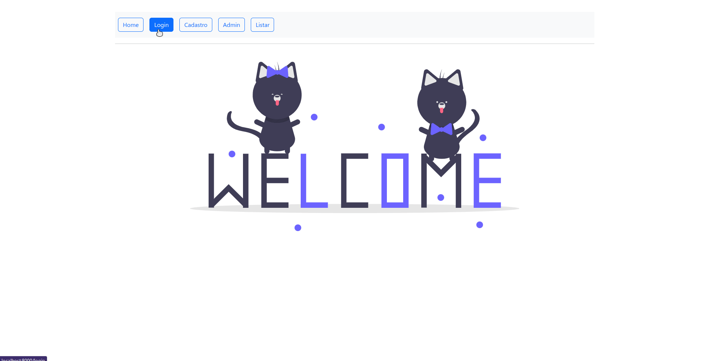

<p align="center">
    
</p>

<h1 align="center">Agenda de Contatos - CRUD</h1>
<p align="center">
 <a href="#o-desafio">Desafio</a> •
 <a href="#exercícios">Screenshot</a> •
 <a href="#tecnologias">Tecnologias</a> •
 <a href="#pré-requisitos">Pré Requisitos</a> •
 <a href="#clonar-o-repositório">Clonar repositório</a> •
 <a href="#autor">Autor</a>
</p>

---

<br>

### O Desafio

Criar um crud de uma agenda de contatos onde salva o contato em um arquivo .csv, feito para o programa DevStart Paylivre da Be Academy.

### Screenshot

<h1 align="center">

</h1>


### Tecnologias:

- ✔️ HTML
- ✔️ Bootstrap 5
- ✔️ PHP


### Pré Requisitos

- Antes de iniciar o projeto, você vai precisar das seguintes ferramentas:

  - ✔️ [PHP](https://www.php.net/manual/pt_BR/install.php)
  - ✔️ [Git](https://git-scm.com/)

### Clonar o repositório

```bash
$ git clone https://github.com/ThiagoGalhardo/beacademy-devstart-crud-contatos-php.git
```

### Autor


Feito com 💜 por Thiago Galhardo 👋

[](https://www.linkedin.com/in/thgalhardo/)
[](https://github.com/thiagogalhardo/)
